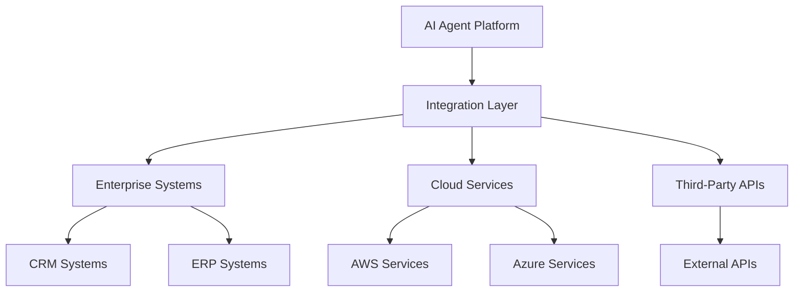

# Tiation AI Agents

<div align="center">
  <h3>🤖 Enterprise-Grade AI Automation Platform</h3>
  <p>Revolutionize business process automation with autonomous AI agents</p>
  
  
  
  
  
</div>

---

## 📋 Table of Contents

- [About](#about)
- [Architecture](#architecture)
- [Features](#features)
- [Screenshots](#screenshots)
- [Quick Start](#quick-start)
- [AI Agent Types](#ai-agent-types)
- [Enterprise Integration](#enterprise-integration)
- [Installation](#installation)
- [Documentation](#documentation)
- [Enterprise Deployment](#enterprise-deployment)
- [Contributing](#contributing)
- [Support](#support)

## 🎯 About

Tiation AI Agents is an enterprise-grade AI automation platform that revolutionizes business process automation using autonomous AI agents. Our platform enables organizations to deploy intelligent agents that can handle complex workflows, make decisions, and integrate seamlessly with existing enterprise systems.

**Key Benefits:**
- 🤖 **Autonomous Operation**: AI agents that operate independently with minimal human intervention
- 🔒 **Enterprise Security**: Built-in security frameworks and compliance standards
- 📊 **Advanced Analytics**: Real-time monitoring and performance analytics
- 🔧 **Flexible Integration**: Seamless integration with existing enterprise systems
- 📈 **Scalable Architecture**: Designed to handle enterprise-scale operations

## 🏗️ Architecture


Tiation AI Agents uses a distributed microservices architecture:

- **Agent Orchestrator**: Central management system for AI agents
- **AI Engine**: Core artificial intelligence processing unit
- **Integration Layer**: Seamless connection to enterprise systems
- **Security Framework**: End-to-end security and compliance
- **Analytics Platform**: Real-time monitoring and reporting

For detailed architecture documentation, see [Architecture Guide](docs/ARCHITECTURE.md).

## 📸 Screenshots

### AI Agent Dashboard

*Comprehensive dashboard for managing and monitoring AI agents across your organization*

### Workflow Automation

*Visual workflow builder for creating complex automation processes*

### Performance Analytics

*Real-time analytics and performance monitoring for deployed AI agents*

### Enterprise Integration

*Seamless integration with popular enterprise systems and tools*

## 🚀 Features

### Core Capabilities
- **Intelligent Decision Making**: AI agents that can make complex decisions based on data analysis
- **Natural Language Processing**: Advanced NLP capabilities for document processing and communication
- **Workflow Automation**: Automated business process execution with minimal human intervention
- **Predictive Analytics**: Machine learning models for forecasting and trend analysis
- **Multi-Modal Processing**: Support for text, images, voice, and structured data

### Enterprise Features
- **Role-Based Access Control**: Granular permissions and user management
- **Audit Trails**: Complete logging and monitoring of all agent activities
- **Compliance Framework**: Built-in support for GDPR, SOC2, and other standards
- **High Availability**: Distributed architecture with automatic failover
- **Custom Integrations**: Extensible API for custom enterprise integrations

## 🚀 Quick Start

### Prerequisites
- **Node.js**: Version 16.0 or higher
- **Docker**: Version 20.0 or higher
- **PostgreSQL**: Version 13.0 or higher
- **Redis**: Version 6.0 or higher

### Installation

```bash
# Clone the repository
git clone https://github.com/tiation/tiation-ai-agents.git
cd tiation-ai-agents

# Install dependencies
npm install

# Set up environment variables
cp .env.example .env
# Edit .env with your configuration

# Start the development server
npm run dev
```

### Your First AI Agent

```javascript
// Create a simple document processing agent
const agent = new TiationAgent({
  name: 'DocumentProcessor',
  type: 'nlp',
  capabilities: ['document_analysis', 'text_extraction'],
  integrations: ['sharepoint', 'google_drive']
});

// Deploy the agent
await agent.deploy();
console.log('Agent deployed successfully!');
```

## 🤖 AI Agent Types

### Document Processing Agents
- **Invoice Processing**: Automated invoice data extraction and validation
- **Contract Analysis**: Legal document review and clause extraction
- **Report Generation**: Automated report creation from data sources

### Customer Service Agents
- **Chatbot Integration**: Intelligent customer support automation
- **Ticket Routing**: Automated support ticket classification and routing
- **Sentiment Analysis**: Customer feedback analysis and insights

### Data Analytics Agents
- **Predictive Modeling**: Machine learning model deployment and management
- **Data Quality**: Automated data validation and cleansing
- **Reporting**: Automated dashboard and report generation

### Integration Agents
- **API Orchestration**: Automated API integration and data synchronization
- **Database Management**: Automated database operations and maintenance
- **Cloud Services**: Multi-cloud platform management and optimization

## 🏢 Enterprise Integration

### Supported Systems
- **CRM**: Salesforce, HubSpot, Microsoft Dynamics
- **ERP**: SAP, Oracle, NetSuite
- **Communication**: Slack, Microsoft Teams, Discord
- **Cloud Platforms**: AWS, Azure, Google Cloud
- **Databases**: PostgreSQL, MySQL, MongoDB, Redis

### Integration Architecture



## 📦 Installation

### Docker Installation (Recommended)

```bash
# Clone the repository
git clone https://github.com/tiation/tiation-ai-agents.git
cd tiation-ai-agents

# Start with Docker Compose
docker-compose up -d

# Access the dashboard
open http://localhost:3000
```

### Manual Installation

```bash
# Install dependencies
npm install

# Set up database
npm run db:setup

# Start the application
npm start
```

## 📚 Documentation

Comprehensive documentation is available in our [GitHub Pages site](https://tiation.github.io/tiation-ai-agents/).

### Quick Reference
- **[API Documentation](docs/API.md)** - Complete API reference
- **[Agent Development Guide](docs/AGENT_DEVELOPMENT.md)** - Creating custom agents
- **[Integration Guide](docs/INTEGRATIONS.md)** - Enterprise system integrations
- **[Security Guide](docs/SECURITY.md)** - Security best practices
- **[Deployment Guide](docs/DEPLOYMENT.md)** - Production deployment

## 🏢 Enterprise Deployment

### Deployment Options

1. **Cloud Deployment**: Fully managed cloud deployment
2. **On-Premises**: Private cloud deployment for sensitive data
3. **Hybrid**: Combination of cloud and on-premises deployment
4. **Multi-Cloud**: Deployment across multiple cloud providers

### Scalability Features

- **Auto-scaling**: Automatic resource scaling based on demand
- **Load Balancing**: Distributed load balancing across multiple instances
- **Fault Tolerance**: Automatic failover and recovery mechanisms
- **Monitoring**: Comprehensive monitoring and alerting system

### Security & Compliance

- **Data Encryption**: End-to-end encryption for all data
- **Access Control**: Role-based access control and authentication
- **Audit Logging**: Complete audit trails for all operations
- **Compliance**: GDPR, SOC2, HIPAA compliance support

For detailed enterprise deployment guides, see [Enterprise Deployment Guide](docs/ENTERPRISE_DEPLOYMENT.md).

## 🤝 Contributing

We welcome contributions! Please see our [Contributing Guide](CONTRIBUTING.md) for details.

### Development Setup

```bash
# Fork and clone the repository
git clone https://github.com/YOUR_USERNAME/tiation-ai-agents.git
cd tiation-ai-agents

# Install development dependencies
npm install
npm run dev:setup

# Run tests
npm test

# Start development server
npm run dev
```

### Code Standards

- Follow ESLint configuration
- Write comprehensive tests
- Document all public APIs
- Use TypeScript for type safety

## 📞 Support

### Getting Help

- **Documentation**: [GitHub Pages Site](https://tiation.github.io/tiation-ai-agents/)
- **Issues**: [Report bugs or request features](https://github.com/tiation/tiation-ai-agents/issues)
- **Discussions**: [GitHub Discussions](https://github.com/tiation/tiation-ai-agents/discussions)
- **Enterprise Support**: [tiatheone@protonmail.com](mailto:tiatheone@protonmail.com)

### Community

- **GitHub**: [tiation](https://github.com/tiation)
- **AI/ML Community**: [AI Discord](https://discord.gg/ai)
- **Developer Forums**: [Stack Overflow](https://stackoverflow.com/questions/tagged/tiation-ai-agents)

### Enterprise Support

For enterprise customers, we offer:
- 24/7 priority support
- Custom agent development
- On-site training and consultation
- Security audits and compliance assistance
- Dedicated account management

---

<div align="center">
  
  
  
</div>

*Part of the [Tiation](https://github.com/tiation) ecosystem*
