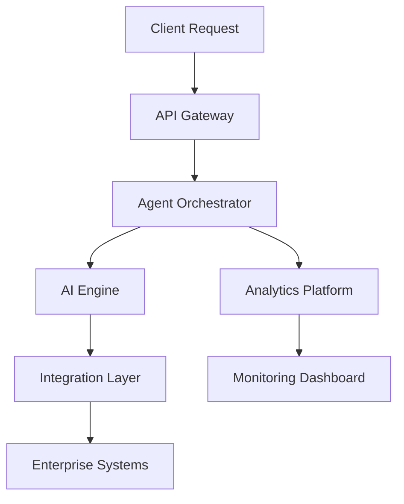

# Architecture Guide

## Overview

Tiation AI Agents utilizes a modern microservices architecture designed for enterprise-scale deployment. This document provides a comprehensive overview of the system architecture, components, and design decisions.

## System Architecture

### Core Components

#### Agent Orchestrator
- **Purpose**: Central management system for AI agents
- **Responsibilities**:
  - Agent lifecycle management
  - Resource allocation
  - Load balancing
  - Health monitoring

#### AI Engine
- **Purpose**: Core artificial intelligence processing unit
- **Capabilities**:
  - Machine learning model execution
  - Natural language processing
  - Computer vision
  - Decision making algorithms

#### Integration Layer
- **Purpose**: Seamless connection to enterprise systems
- **Features**:
  - API gateway
  - Data transformation
  - Protocol translation
  - Security enforcement

#### Security Framework
- **Purpose**: End-to-end security and compliance
- **Components**:
  - Authentication and authorization
  - Data encryption
  - Audit logging
  - Compliance monitoring

#### Analytics Platform
- **Purpose**: Real-time monitoring and reporting
- **Features**:
  - Performance metrics
  - Usage analytics
  - Predictive insights
  - Custom dashboards

## Deployment Architecture

### Microservices Design

Each component is designed as an independent microservice with:
- Independent scaling capabilities
- Fault isolation
- Technology stack flexibility
- Continuous deployment support

### Data Flow

### Security Model

- **Zero Trust Architecture**: All communications are authenticated and encrypted
- **Role-Based Access Control**: Granular permissions for different user types
- **Data Encryption**: End-to-end encryption for all data in transit and at rest
- **Audit Trails**: Complete logging of all system activities

## Scalability and Performance

### Horizontal Scaling
- Container-based deployment
- Kubernetes orchestration
- Auto-scaling based on demand
- Load balancing across instances

### Performance Optimization
- Caching strategies
- Database optimization
- CDN integration
- Asynchronous processing

## Technology Stack

### Backend
- **Runtime**: Node.js / Python
- **Framework**: Express.js / FastAPI
- **Database**: PostgreSQL / MongoDB
- **Cache**: Redis
- **Message Queue**: RabbitMQ

### Frontend
- **Framework**: React / Vue.js
- **State Management**: Redux / Vuex
- **UI Components**: Material-UI / Ant Design
- **Build Tool**: Webpack / Vite

### Infrastructure
- **Containerization**: Docker
- **Orchestration**: Kubernetes
- **Cloud Platform**: AWS / Azure / GCP
- **CI/CD**: GitHub Actions / Jenkins

## Monitoring and Observability

### Application Monitoring
- **Metrics**: Prometheus + Grafana
- **Logging**: ELK Stack (Elasticsearch, Logstash, Kibana)
- **Tracing**: Jaeger
- **Health Checks**: Custom health endpoints

### Business Metrics
- Agent performance metrics
- User engagement analytics
- System resource utilization
- Error rates and response times

## Disaster Recovery

### Backup Strategy
- Database backups with point-in-time recovery
- Configuration backups
- Code repository backups
- Data archival strategies

### Failover Mechanisms
- Multi-region deployment
- Database replication
- Load balancer failover
- Automatic recovery procedures

## Integration Patterns

### Enterprise System Integration
- **API-First Design**: RESTful APIs for all integrations
- **Event-Driven Architecture**: Async messaging for real-time updates
- **Data Synchronization**: Batch and real-time sync capabilities
- **Protocol Support**: REST, GraphQL, WebSockets, gRPC

### Third-Party Integrations
- **CRM Systems**: Salesforce, HubSpot
- **ERP Systems**: SAP, Oracle
- **Communication**: Slack, Teams
- **Cloud Services**: AWS, Azure, GCP

## Development Guidelines

### Code Standards
- **Language**: TypeScript for type safety
- **Testing**: Unit, integration, and end-to-end tests
- **Documentation**: Comprehensive API documentation
- **Security**: Security-first development practices

### Deployment Process
- **CI/CD Pipeline**: Automated testing and deployment
- **Environment Management**: Development, staging, production
- **Configuration Management**: Environment-specific configurations
- **Rollback Strategy**: Quick rollback capabilities

## Future Considerations

### Planned Enhancements
- **Multi-tenant Architecture**: Support for multiple organizations
- **Edge Computing**: Distributed processing capabilities
- **Advanced AI Models**: Integration with latest AI technologies
- **Blockchain Integration**: Immutable audit trails

### Scalability Roadmap
- **Global Deployment**: Multi-region availability
- **Performance Optimization**: Advanced caching strategies
- **Cost Optimization**: Resource usage optimization
- **Compliance Expansion**: Additional regulatory compliance

---

For more detailed technical specifications, see:
- [API Documentation](API.md)
- [Security Guide](SECURITY.md)
- [Deployment Guide](DEPLOYMENT.md)
